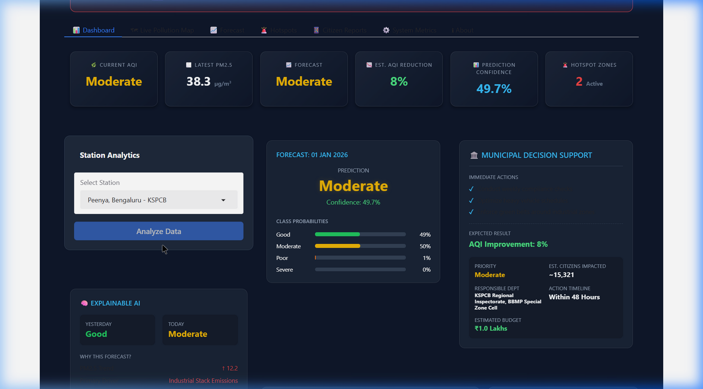
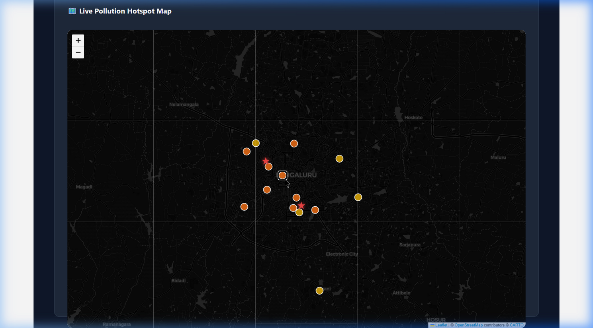
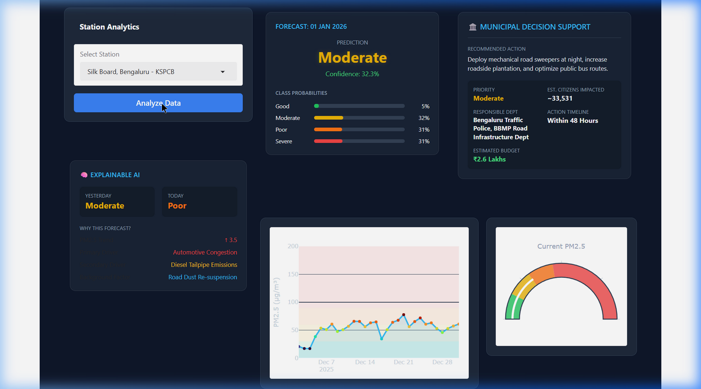

# 🌿 AirGuard AI
> **AI-Powered Urban Pollution Hotspot Detection & Clean Street Decision Support**


---

AirGuard AI is an operations command center for municipal authorities in Bengaluru, designed to transition urban air quality management from passive monitoring to active, data-driven municipal intervention. By integrating live sensor feeds, advanced machine learning (Random Forest forecasting & DBSCAN hotspot clustering), and localized explainable AI, AirGuard AI dynamically estimates budgets, timelines, citizens impacted, and specific mitigation actions on a station-by-station basis.


---

## 📸 Interface Previews

### Dashboard Preview


### Interactive Map


### Municipal Decision Support & KPI Cards


---

## 🚀 Key Innovation Pillars

### 1. Dynamic Decision Support System (DDSS)
Unlike traditional static air quality dashboards, AirGuard AI features an actionable mitigation engine. Selecting a station dynamically updates the **Municipal Decision Support** panel:
*   **Actions:** Action recommendations are tailored to the station's classification:
    *   *Industrial Zones (e.g., Peenya):* Stack inspections, heavy transport restriction, and industrial green belts.
    *   *Traffic Zones (e.g., Silk Board):* Water mist cannons, mechanized road sweeping, and traffic signal optimization.
    *   *Residential/Commercial Zones (e.g., Hebbal):* Localized construction dust controls, commercial fuel compliance checks, and neighborhood canopy expansion.
*   **Budgets:** Dynamically scales based on forecasted PM2.5 levels (ranging from `₹0.8L` to `₹8.7L`).
*   **Citizen Impact:** Computes estimated citizens impacted using ward population density multipliers.
*   **Responsible Agencies:** Maps exact ownership to municipal departments (e.g., *Bengaluru Traffic Police*, *BBMP Road Infrastructure Dept*, *KSPCB Inspectorate*).

### 2. Deep Machine Learning Pipeline
*   **Predictive Forecasting:** Random Forest Classifier trained on **1.37 Million CPCB/KSPCB records** to predict next-day AQI categories (*Good, Moderate, Poor, Severe*) with cross-validated confidence scores.
*   **Spatial Hotspot Detection:** Running DBSCAN spatial clustering algorithms (`eps=0.015`, `min_samples=3`) on coordinates to identify active pollution clusters.
*   **Feature Engineering:** Features include rolling 7-day/30-day averages, temporal indicators (day of week, month, season), and spatial ward hot-coding.

### 3. Localized Explainable AI (XAI)
Provides transparency for municipal administrators by extracting temporal trends and listing primary/secondary drivers:
*   *Automotive Congestion* and *Diesel Tailpipe Emissions* in high-traffic wards.
*   *Industrial Stack Emissions* and *Suspended Coal Fly Ash* in manufacturing zones.
*   *Localized Waste Burning* and *Construction Dust* in residential areas.

---

## 🏆 Key Results Achieved

*   **✔ 1.37 Million Records:** High-density, real-world historical data foundation.
*   **✔ 14 Monitoring Stations:** Seamless coverage across Bengaluru (CPCB & KSPCB sensor sites).
*   **✔ Random Forest:** Robust predictive categorizations.
*   **✔ DBSCAN:** Automatic clustering of coordinates into active high-density risk zones.
*   **✔ Dynamic Decision Support:** Tailored budgets, timelines, and actionable checkmarks.
*   **✔ Explainable AI:** Injects trust and interpretability into the prediction pipeline.
*   **✔ Interactive Dashboard:** Fully operational dark carbon-glassmorphic cockpit.

---

## 🔮 Future Scope

*   **Google Vertex AI:** Scaling model tuning and pipeline triggers in cloud environments.
*   **Gemini Live integration:** Interactive conversational voice alerts for municipal response drivers.
*   **Satellite Imagery & IoT integration:** Correlating local ground sensors with high-resolution Sentinel satellite feeds.
*   **Citizen Mobile App:** Direct report ingestion with auto-geotagging and real-time intervention updates.

---

## 🛠️ System Architecture

```
                                      [CITIZEN REPORTS] 
                                              │ (Crowdsourced)
                                              ▼
[CPCB/KSPCB SENSORS] ──➔ [DATA PIPELINE] ──➔ [RANDOM FOREST & DBSCAN] ──➔ [MITIGATION ENGINE] ──➔ [OPERATIONS PORTAL]
```

---

## 📂 Repository Directory Layout

```
airguard-ai/
├── app.py                      # Central Gradio Controller & UI Layout
├── README.md                   # Platform Documentation & Guide
├── LICENSE                     # MIT License File
├── requirements.txt            # Python Dependencies
├── .gitignore                  # Git Version Control Exclusions
├── assets/
│   └── screenshots/            # App Previews and Screenshots
├── data/
│   ├── raw/                    # Historical and Real-time Sensor Data
│   └── processed/
│       ├── hotspot_clusters.csv  # Output of DBSCAN Spatial Analysis
│       ├── reports.csv           # Persistent Citizen Reports Database
│       └── ward_mapped_stations.csv # Geocoded Ward-Station Mapping
├── models/
│   ├── aqi_category_rf.pkl     # Primary RF Classifier Model
│   └── pm25_forecast_rf.pkl    # PM2.5 Forecaster Model
└── scripts/
    ├── preprocess_aqi.py       # Raw Data Cleansing & Ingestion
    ├── train_pm25_forecast.py  # Model Training & Feature Extraction
    └── test_data.py            # Local Data Ingestion Tests
```

---

## ⚙️ Installation & Local Setup

### System Prerequisites
*   Python 3.10+
*   Git

### Execution Steps
1.  **Clone the project repository:**
    ```bash
    git clone https://github.com/Manasa-L-Hegde/airguard-ai.git
    cd airguard-ai
    ```
2.  **Initialize the virtual environment & install packages:**
    ```bash
    python -m venv venv
    venv\Scripts\activate   # On Windows
    source venv/bin/activate # On Unix/macOS
    pip install -r requirements.txt
    ```
3.  **Train the ML Models (Required if running for the first time):**
    ```bash
    python scripts/train_pm25_forecast.py
    ```
4.  **Boot the dashboard server:**
    ```bash
    python app.py
    ```
    Navigate to `http://localhost:7860/` to explore the live dashboard interface.

---

## 📄 License
This project is licensed under the MIT License - see the [LICENSE](LICENSE) file for details.
