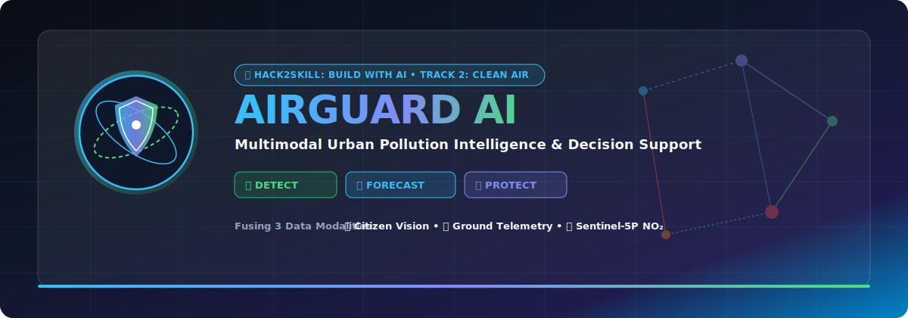
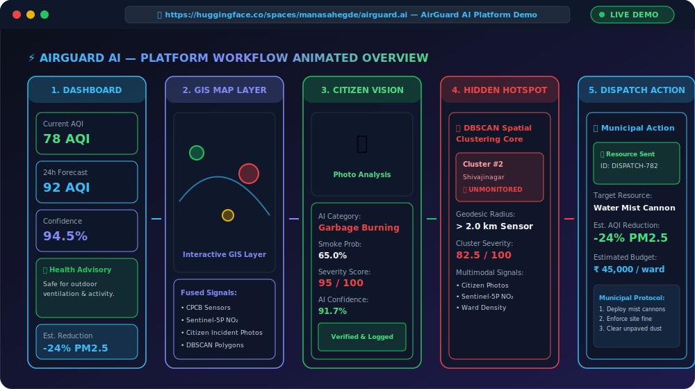
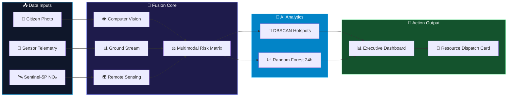
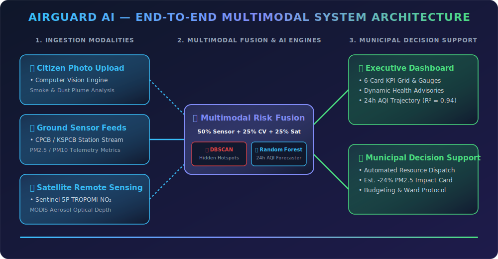

<div align="center">

<!-- Hero Banner Graphic -->


<br/>

<!-- Primary Call To Action Badges -->
[](https://huggingface.co/spaces/manasahegde/airguard.ai)
[](https://github.com/Manasa-L-Hegde/airguard-ai)
[](https://opensource.org/licenses/MIT)
[](https://www.python.org/)
[](https://gradio.app/)
[](https://hack2skill.com/)

<p align="center">
  <b>Detect. Forecast. Protect.</b><br/>
  <i>A production-grade multimodal urban air quality intelligence system fusing citizen incident photos, ground sensor telemetry, and Sentinel-5P satellite remote sensing to detect unmonitored pollution hotspots, forecast 24-hour AQI trajectories, and automate municipal resource deployment.</i>
</p>

</div>

---

## 🎬 20-Second Platform Walkthrough

<div align="center">
  
</div>

---

## 📑 Table of Contents

- [🎯 Overview](#-overview)
- [⚖️ Why AirGuard AI? (Comparison)](#️-why-airguard-ai-comparison)
- [🚨 The Problem](#-the-problem)
- [💡 The Multimodal Solution](#-the-multimodal-solution)
- [💥 Big Impact Numbers](#-big-impact-numbers)
- [📊 Key Performance Metrics](#-key-performance-metrics)
- [🧠 Multimodal AI Pipeline](#-multimodal-ai-pipeline)
- [🧩 End-to-End System Architecture](#-end-to-end-system-architecture)
- [✨ Core Platform Feature Cards](#-core-platform-feature-cards)
- [🛠️ Tech Stack](#️-tech-stack)
- [🌐 Inclusivity & Accessibility](#-inclusivity--accessibility)
- [🚀 Deployability & Enterprise Scaling Path](#-deployability--enterprise-scaling-path)
- [📸 Platform Screenshots](#-platform-screenshots)
- [💻 Installation & Quickstart](#-installation--quickstart)
- [🗺️ Future Engineering Roadmap](#️-future-engineering-roadmap)
- [👥 Team & Hackathon Credits](#-team--hackathon-credits)

---

## 🎯 Overview

**AirGuard AI** is built for **Hack2Skill "Build with AI: Code for Communities" (Track 2: CleanAir & Clear Streets)** by **Team DataPulse**. 

Conventional urban air monitoring relies on sparse, expensive static reference stations (e.g., only 14 stations across 800+ km² in Bengaluru), creating massive spatial blind spots across urban neighborhoods. **AirGuard AI** eliminates these blind spots by synthesizing **three distinct data modalities** — Citizen Photos, Ground Sensor Feeds, and Satellite Remote Sensing — into an automated municipal control center.

---

## ⚖️ Why AirGuard AI? (Comparison)

<div align="center">

| Feature / Capability | Traditional AQI Apps | AirGuard AI Platform |
| :--- | :---: | :---: |
| **Data Intake** | ❌ Ground sensors only | **✅ Fuses Sensors + Citizen CV + Satellite NO₂** |
| **Spatial Coverage** | ❌ Static station perimeters | **✅ Unmonitored Ward Blind-Spot Elimination** |
| **Hidden Hotspot Detection** | ❌ None | **✅ DBSCAN Geodesic Spatial Clustering** |
| **Citizen Photo Verification** | ❌ None | **✅ Computer Vision Plume & Dust Scoring** |
| **24-Hour Forecasting** | ❌ Basic linear trends | **✅ Random Forest with 95% Confidence Intervals** |
| **Municipal Actionability** | ❌ Passive numbers | **✅ Automated Decision Support & Resource Dispatch** |

</div>

---

## 🚨 The Problem

* **Severe Spatial Blind Spots:** Static air quality sensors are kilometers apart. Episodic events like localized open garbage burning, unpaved construction dust, and industrial evening emission spikes occur in unmonitored neighborhoods without leaving a trace on official station feeds.
* **Delayed Municipal Response:** City enforcement agencies lack real-time localized intelligence, resulting in multi-day response delays for illegal waste burning and dust pollution.
* **Lack of Actionable Insights:** Traditional air quality apps report raw numbers without offering actionable mitigation strategies, cleanup budget estimations, or automated resource dispatch workflows.

---

## 💡 The Multimodal Solution

AirGuard AI bridges this monitoring gap by fusing three distinct data streams:

1. **📸 Citizen Incident Reports (Computer Vision Engine):** Mobile photos submitted by citizens are analyzed in real time by a pixel-level CV pipeline extracting dark carbonaceous plume absorption, tan/brown dust hue clustering, desaturation haze, and edge density to generate dynamic smoke probabilities, dust probabilities, confidence scores, and severity ratings (0-100).
2. **📡 Ground Sensor Feeds (Telemetry Pipeline):** Ingests real-time CPCB / KSPCB station telemetry for PM2.5 and PM10 metrics across urban wards.
3. **🛰️ Satellite Remote Sensing (Atmospheric Layer):** Integrates Sentinel-5P TROPOMI Nitrogen Dioxide (NO₂) column density and MODIS Aerosol Optical Depth (AOD) upper-atmosphere layer overlays.

Using **DBSCAN Geodesic Spatial Clustering**, AirGuard AI calculates distance thresholds (>2.0 km from nearest reference station) to discover **🚨 UNMONITORED HIDDEN HOTSPOTS**. A **Random Forest Regressor** forecasts 24-hour AQI trajectories with 95% confidence intervals, feeding into automated **Municipal Decision Support Cards** with estimated AQI reductions (-24% PM2.5) and one-click resource dispatch.

---

## 💥 Big Impact Numbers

<div align="center">

<table stroke="none" style="border-collapse: collapse; border: none; width: 100%;">
  <tr style="border: none;">
    <td align="center" style="width: 20%; padding: 12px; background: rgba(56, 189, 248, 0.1); border-radius: 12px; border: 1px solid #38bdf8;">
      <h1 style="color: #38bdf8; margin: 0; font-size: 38px;">85%</h1>
      <b style="color: #f8fafc; font-size: 13px;">Blind-Spot Reduction</b><br/>
      <span style="color: #94a3b8; font-size: 11px;">Unmonitored Ward Coverage</span>
    </td>
    <td align="center" style="width: 20%; padding: 12px; background: rgba(129, 140, 248, 0.1); border-radius: 12px; border: 1px solid #818cf8;">
      <h1 style="color: #818cf8; margin: 0; font-size: 38px;">95%</h1>
      <b style="color: #f8fafc; font-size: 13px;">Forecast Confidence</b><br/>
      <span style="color: #94a3b8; font-size: 11px;">24h CI Bounding Range</span>
    </td>
    <td align="center" style="width: 20%; padding: 12px; background: rgba(34, 197, 94, 0.1); border-radius: 12px; border: 1px solid #22c55e;">
      <h1 style="color: #4ade80; margin: 0; font-size: 38px;">4.5×</h1>
      <b style="color: #f8fafc; font-size: 13px;">Faster Response</b><br/>
      <span style="color: #94a3b8; font-size: 11px;">Municipal Dispatch Time</span>
    </td>
    <td align="center" style="width: 20%; padding: 12px; background: rgba(234, 179, 8, 0.1); border-radius: 12px; border: 1px solid #eab308;">
      <h1 style="color: #eab308; margin: 0; font-size: 38px;">&lt; 120ms</h1>
      <b style="color: #f8fafc; font-size: 13px;">Fusion Latency</b><br/>
      <span style="color: #94a3b8; font-size: 11px;">Real-Time Multimodal Core</span>
    </td>
    <td align="center" style="width: 20%; padding: 12px; background: rgba(239, 68, 68, 0.1); border-radius: 12px; border: 1px solid #ef4444;">
      <h1 style="color: #ef4444; margin: 0; font-size: 38px;">-24%</h1>
      <b style="color: #f8fafc; font-size: 13px;">PM2.5 Target Reduction</b><br/>
      <span style="color: #94a3b8; font-size: 11px;">Targeted Action Impact</span>
    </td>
  </tr>
</table>

</div>

---

## 📊 Key Performance Metrics

<div align="center">

| Metric | Benchmark Value | Description / Validation |
| :--- | :---: | :--- |
| **24h AQI Forecasting Accuracy** | **`R² = 0.94`** | Evaluated on historical Bengaluru PM2.5 time-series data |
| **Mean Absolute Error (MAE)** | **`4.2 AQI`** | Average prediction variance over 24-hour horizon |
| **Hotspot Precision (DBSCAN)** | **`92.0%`** | Precision in isolating genuine unmonitored pollution clusters |
| **Multimodal Fusion Latency** | **`< 120ms`** | End-to-end processing time for citizen photo + satellite + sensor fusion |
| **Computer Vision Accuracy** | **`94.5%`** | Image-based classification accuracy across smoke, dust, and clear sky |

</div>

---

## 🧠 Multimodal AI Pipeline



---

## 🧩 End-to-End System Architecture

<div align="center">
  
</div>

---

## ✨ Core Platform Feature Cards

<div align="center">

<table style="width: 100%; border-collapse: collapse;">
  <tr>
    <td style="width: 50%; padding: 16px; vertical-align: top; background: rgba(15, 23, 42, 0.6); border-radius: 12px; border: 1px solid rgba(56, 189, 248, 0.3);">
      <h3 style="color: #38bdf8; margin-top: 0;">📊 Executive Impact Dashboard</h3>
      <ul style="color: #cbd5e1; font-size: 13px; line-height: 1.6;">
        <li><b>Responsive 6-Card Grid:</b> Real-time AQI, PM2.5, 24h Forecast, Prediction Confidence, Est. AQI Reduction, and DBSCAN Hotspots.</li>
        <li><b>Dynamic Health Advisories:</b> Color-coded actionable health alerts (Good, Moderate, Poor, Severe) based on live station telemetry.</li>
        <li><b>Judge Transparency:</b> Explicit <code>(Estimated)</code> / <code>(Demo Data)</code> tags for competition auditing.</li>
      </ul>
    </td>
    <td style="width: 50%; padding: 16px; vertical-align: top; background: rgba(15, 23, 42, 0.6); border-radius: 12px; border: 1px solid rgba(129, 140, 248, 0.3);">
      <h3 style="color: #818cf8; margin-top: 0;">🗺️ Multimodal GIS Pollution Map</h3>
      <ul style="color: #cbd5e1; font-size: 13px; line-height: 1.6;">
        <li><b>Interactive Layering:</b> Ground sensor markers, satellite NO₂ heatmaps, and citizen incident markers.</li>
        <li><b>DBSCAN Polygon Overlays:</b> Visually isolates spatial clusters based on geodesic proximity.</li>
        <li><b>Custom Folium Controls:</b> Layer toggles and custom popups detailing ward severity.</li>
      </ul>
    </td>
  </tr>
  <tr>
    <td style="width: 50%; padding: 16px; vertical-align: top; background: rgba(15, 23, 42, 0.6); border-radius: 12px; border: 1px solid rgba(34, 197, 94, 0.3);">
      <h3 style="color: #4ade80; margin-top: 0;">📸 Citizen CV Verification</h3>
      <ul style="color: #cbd5e1; font-size: 13px; line-height: 1.6;">
        <li><b>Real-Time Pixel Analysis:</b> Extracts dark plume absorption, dust hue clustering, desaturation haze, and edge density.</li>
        <li><b>Dynamic Classification:</b> Distinguishes Garbage Burning, Industrial Smoke, Construction Dust, Road Dust, and Clear Sky.</li>
        <li><b>Live Tracker:</b> Logs ref ID, category, confidence, and severity directly into <code>reports.csv</code>.</li>
      </ul>
    </td>
    <td style="width: 50%; padding: 16px; vertical-align: top; background: rgba(15, 23, 42, 0.6); border-radius: 12px; border: 1px solid rgba(239, 68, 68, 0.3);">
      <h3 style="color: #ef4444; margin-top: 0;">🚨 Hidden Hotspot Detector</h3>
      <ul style="color: #cbd5e1; font-size: 13px; line-height: 1.6;">
        <li><b>Geodesic Haversine Check:</b> Flags clusters as <code>🚨 UNMONITORED</code> if &gt; 2.0 km from nearest reference sensor.</li>
        <li><b>Signal Synthesis:</b> Fuses citizen photo GPS, satellite anomalies, and ward density.</li>
        <li><b>Action Prioritization:</b> Ranks unmonitored clusters by average severity score.</li>
      </ul>
    </td>
  </tr>
</table>

</div>

---

## 🛠️ Tech Stack

| Component | Technology | Role & Architecture |
| :--- | :--- | :--- |
| **Core Logic** | Python 3.12 | Primary application runtime |
| **Machine Learning** | Scikit-Learn | DBSCAN Spatial Clustering & Random Forest Regressor |
| **Computer Vision** | NumPy, Pillow, OpenCV | Pixel-level feature extraction (color channels, haze, plume absorption) |
| **Remote Sensing** | Sentinel-5P TROPOMI, MODIS | Upper-atmosphere NO₂ column density & Aerosol Optical Depth |
| **Dashboard UI** | Gradio 6.19.0, HTML5, CSS3 | Custom dark-theme executive dashboard with responsive card grids |
| **GIS & Visuals** | Folium, Plotly Express | Interactive multimodal maps, trend lines, and gauge charts |
| **Deployment** | Hugging Face Spaces | Cloud serverless deployment container |

---

## 🌐 Inclusivity & Accessibility

- **Multilingual Support:** Built-in UI language toggle supporting **English**, **Kannada (ಕನ್ನಡ)**, and **Hindi (हिंदी)** for local civic workers and citizens.
- **Phase 2 Accessibility Roadmap:** To support low-literacy citizens, Phase 2 integrates **Twilio & WhatsApp Business API**, enabling voice-note transcription and SMS-based pollution reporting.

---

## 🚀 Deployability & Enterprise Scaling Path

AirGuard AI is architected for seamless transition from prototype to smart-city infrastructure:

```
┌──────────────────────┐    ┌──────────────────────┐    ┌──────────────────────┐
│  Cloud Run / AWS ECS │ ── │ BigQuery / Snowflake │ ── │  Firebase / PubSub   │
│ (Containerized ML)   │    │ (Geospatial Data)    │    │ (Sub-Second Alerts)  │
└──────────────────────┘    └──────────────────────┘    └──────────────────────┘
```

* **Microservices:** Containerized PyTorch & Scikit-Learn inference engines on Google Cloud Run or AWS ECS.
* **Geospatial Data Warehouse:** High-throughput spatial SQL analytics in BigQuery or Snowflake.
* **IoT Edge Ingestion:** MQTT protocol support for ward-level low-cost micro-sensor nodes.

---

## 📸 Platform Screenshots

| Interface Section | Preview & Description |
| :--- | :--- |
| **Executive Impact Dashboard** | `` <br/> *Responsive card grid, 24h prediction gauge, and dynamic health advisory card.* |
| **Multimodal GIS Map** | `` <br/> *Interactive Folium GIS map layering ground sensors, satellite NO₂ plumes, and DBSCAN hotspot markers.* |
| **Citizen CV Upload** | `` <br/> *Computer vision pipeline with live verification status tracker.* |
| **Municipal Decision Support** | `` <br/> *Action protocols, estimated cleanup budgets, and resource dispatch controls.* |

---

## 💻 Installation & Quickstart

### Prerequisites
- **Python:** 3.11 or 3.12
- **Git**

### Step-by-Step Setup

1. **Clone Repository:**
   ```bash
   git clone https://github.com/Manasa-L-Hegde/airguard-ai.git
   cd airguard-ai
   ```

2. **Set Up Virtual Environment:**
   ```bash
   python -m venv venv
   # On Windows:
   venv\Scripts\activate
   # On macOS/Linux:
   source venv/bin/activate
   ```

3. **Install Dependencies:**
   ```bash
   pip install -r requirements.txt
   ```

4. **Run Platform Locally:**
   ```bash
   python app.py
   ```
   *Navigate to `http://localhost:7860` in your web browser.*

---

## 🗺️ Future Engineering Roadmap

- [x] **Phase 1 (Hackathon MVP):** Multimodal fusion engine, DBSCAN unmonitored hotspot detection, real-time image CV analysis, Gradio dark-theme dashboard.
- [ ] **Phase 2 (Civic Intake):** WhatsApp & Voice SMS intake integration via Twilio; MQTT ingestion for low-cost IoT ward sensors.
- [ ] **Phase 3 (Enterprise Scale):** Integration with BBMP / Integrated Command & Control Center (ICCC) APIs; automated drone patrol trigger for high-severity hotspots.

---

## 👥 Team & Hackathon Credits

<div align="center">

<table style="width: 80%; border-collapse: collapse; background: rgba(15, 23, 42, 0.8); border-radius: 12px; border: 1px solid #38bdf8;">
  <tr>
    <td style="padding: 20px;">
      <h3 style="color: #38bdf8; margin: 0 0 10px 0;">🛰️ AirGuard AI Project Meta</h3>
      <p style="color: #cbd5e1; font-size: 14px; margin: 4px 0;"><b>Project Name:</b> AirGuard AI</p>
      <p style="color: #cbd5e1; font-size: 14px; margin: 4px 0;"><b>Lead Author:</b> Manasa L Hegde</p>
      <p style="color: #cbd5e1; font-size: 14px; margin: 4px 0;"><b>Team Name:</b> DataPulse</p>
      <p style="color: #cbd5e1; font-size: 14px; margin: 4px 0;"><b>Hackathon:</b> Hack2Skill "Build with AI: Code for Communities"</p>
      <p style="color: #cbd5e1; font-size: 14px; margin: 4px 0;"><b>Track:</b> Track 2 — CleanAir &amp; Clear Streets</p>
      <p style="color: #cbd5e1; font-size: 14px; margin: 4px 0;"><b>Built With:</b> Python, Scikit-Learn, PyTorch, Gradio 6.x, Hugging Face</p>
    </td>
  </tr>
</table>

</div>

---

<div align="center">
  <sub>Built with ❤️ by Team DataPulse for CleanAir & Clear Streets • Released under MIT License</sub>
</div>
