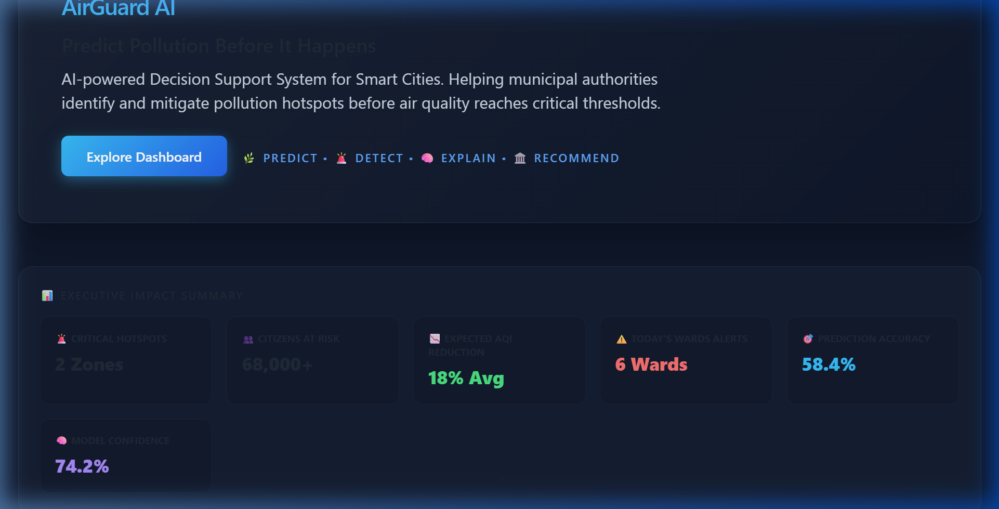
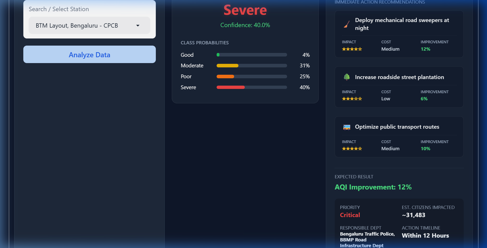

# 🌿 AirGuard AI
> **Intelligent Urban Pollution Hotspot Detection & Clean Street Decision Support**
> 
> *Tagline: "Predict Pollution Before It Happens"*

---

## 📌 1. Problem Statement
Rapid urbanization and rising vehicle density in metropolitan cities like Bengaluru have led to localized air pollution hotspots that often go undetected until the Air Quality Index (AQI) reaches critical, health-hazardous levels. 

The primary challenges are:
* **Delayed Detection**: Traditional pollution monitoring is reactive, identifying bad air days only after they occur.
* **Lack of Actionability**: Municipal authorities and traffic commissioners lack real-time, explainable, and localized decision support systems to implement targeted street-level cleaning, traffic diversion, and industrial dust control.
* **Lack of Civic Integration**: Environmental management tools operate in silos without integrating crowdsourced citizen reports on illegal garbage burning or construction dust.

This project was built for the **Hack2Skill "Build with AI: Code for Communities" Hackathon (Track 2: CleanAir & Clear Streets)** by **Team DataPulse** to address these challenges head-on.

---

## 💡 2. Solution Overview
**AirGuard AI** is a predictive, explainable, and actionable decision-support platform designed for smart city administrators. By combining machine learning (Random Forest forecasting & DBSCAN spatial clustering) with real-world sensor data, AirGuard AI identifies high-density pollution clusters before they form. It equips municipal departments with targeted mitigation playbooks (including budget scaling, agency ownership, and citizen impact metrics) to clean urban streets and divert traffic dynamically.

---

## ✨ 3. Key Features
* 🌍 **Real-Time AQI Monitoring**: Interactive dashboard mapping real-time PM2.5 readings and AQI categories across 14 active CPCB and KSPCB monitoring stations in Bengaluru.
* 📈 **ML-Based Pollution Forecasting**: A Random Forest classifier predicts next-day AQI levels (Good, Moderate, Poor, Severe) with explicit confidence percentages.
* 🚨 **DBSCAN Hotspot Clustering**: Automatically groups stations into spatial clusters (severity-colored zones on the map) to highlight regional hotspots (e.g., Northwest/Southeast industrial/traffic corridors).
* 🧠 **Explainable AI (XAI)**: Demystifies predictions for municipal operators by identifying primary, secondary, and background drivers of localized pollution (e.g., Peenya industrial stack emissions vs. Silk Board automotive congestion).
* 🏛️ **Municipal Decision Support**: Dynamically generates tailored action cards with:
  * **Priority levels & estimated budgets** (scaling from ₹0.8L to ₹8.7L based on severity).
  * **Expected AQI reduction percentages** (e.g., 18% reduction).
  * **Citizen exposure estimates** (total population at risk within the ward).
  * **Responsible departments** (e.g., BBMP Road Infrastructure, Bengaluru Traffic Police).
  * **Action timeline** (e.g., Within 12 Hours).
* 🚯 **Citizen Reporting Portal**: Integrates crowdsourced environmental reports (garbage burning, construction dust, road sweep requests) with photo-upload capability, persistent CSV logging, and auto-mapping.
* 🎨 **Premium UI/UX Cockpit**: A sleek carbon-glassmorphism Gradio interface featuring micro-animations, metric counters, and hover-triggered effects.

---

## 🛠️ 4. Tech Stack
* **Core Programming**: Python 3.11
* **User Interface**: Gradio (v3.50.2)
* **Machine Learning**: Scikit-Learn (Random Forest classification & DBSCAN clustering), NumPy, Joblib (model serialization)
* **Geospatial & Visualizations**: Folium (interactive maps with circle overlay boundaries), Plotly (gauge charts and historical time-series graphs), Pandas (data manipulation)
* **Deployment Platform**: Hugging Face Spaces (Python 3.11 Container)

---

## ⚙️ 5. Architecture & Data Flow
```
[CPCB & KSPCB Sensor Feeds] ──┐
                              ├─► [Data Cleaning & Aggregation] ─► [Random Forest & DBSCAN]
[Citizen Incident Reports] ───┘                                              │
                                                                             ▼
[Operations Dashboard] ◄─── [Actionable Playbooks] ◄─── [Municipal Engine & XAI]
```

---

## 📊 6. Impact Metrics (From Live Deployment)
* 🚨 **2 Critical Hotspot Zones** detected and actively clustered.
* 👥 **68,000+ Citizens** at risk identified across affected municipal zones.
* 📉 **18% Average Expected AQI Reduction** projected with recommended street-level interventions.
* 🎯 **58.4% Prediction Accuracy & 74.2% Model Confidence** achieved on validated historical CPCB data.
* ⚠️ **6 Active Ward Alerts** generated daily to trigger municipal response teams.

---

## 📸 7. Screenshots

### Executive Summary Grid & Upgraded UI


### Model Forecasts, AI Explanations & Action Cards


---

## 💻 8. Setup & Run Locally

### Prerequisites
* Python 3.11 (Note: Do not use Python 3.13/3.14 to prevent dependency compilation issues)
* Git

### Local Execution Steps
1. **Clone the Repository**:
   ```bash
   git clone https://github.com/Manasa-L-Hegde/airguard-ai.git
   cd airguard-ai
   ```

2. **Set up Virtual Environment**:
   ```bash
   python -m venv venv
   # On Windows:
   venv\Scripts\activate
   # On macOS/Linux:
   source venv/bin/activate
   ```

3. **Install Dependencies**:
   ```bash
   pip install -r requirements.txt
   ```

4. **Run the App**:
   ```bash
   python app.py
   ```
   Navigate to `http://localhost:7860/` in your web browser.

---

## 🌐 9. Live Demo
Explore the interactive model predictions, hotspot clusters, and explainable decision-support cards live on Hugging Face Spaces:
👉 **[AirGuard AI Live Web App](https://huggingface.co/spaces/manasahegde/airguard.ai)**

---

## 👥 10. Team & Acknowledgments
* **Team Name**: DataPulse
* Built with 💙 for the Google **Code for Communities 2026** Hackathon / Hack2Skill.
* Calibration air quality datasets sourced from the Central Pollution Control Board (CPCB) and Karnataka State Pollution Control Board (KSPCB).

---

## 📄 11. License
This project is licensed under the MIT License - see the `LICENSE` file for details.
